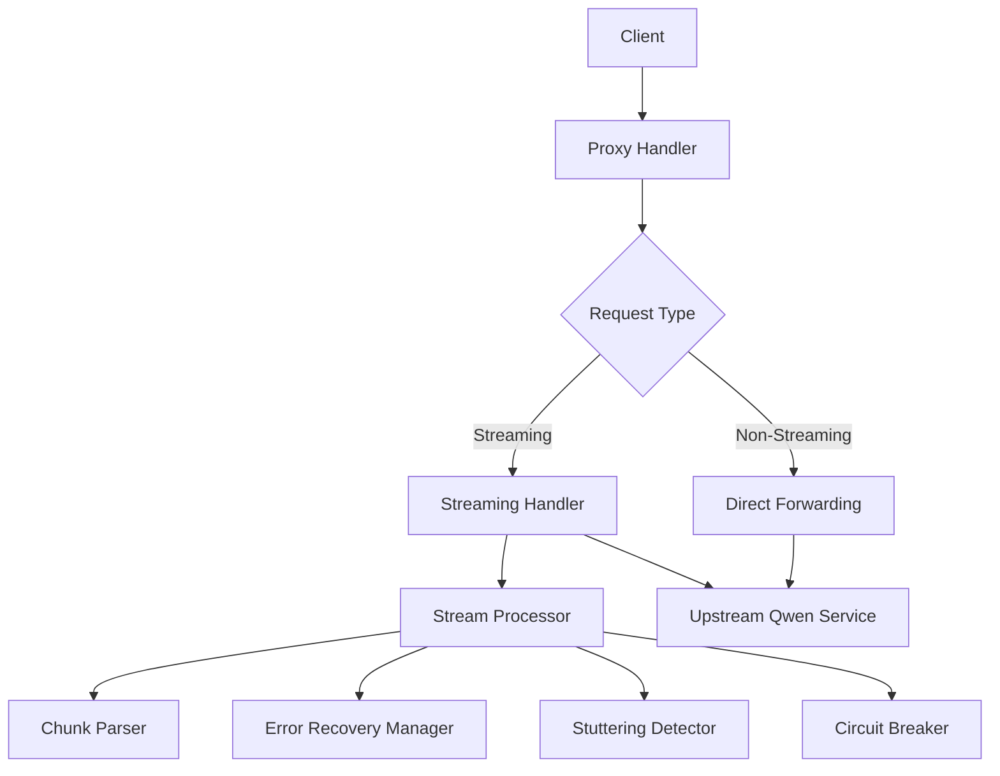
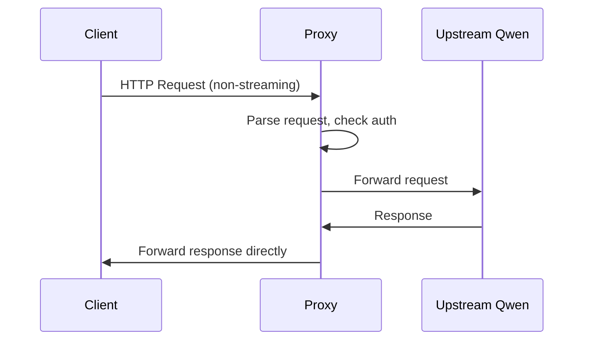
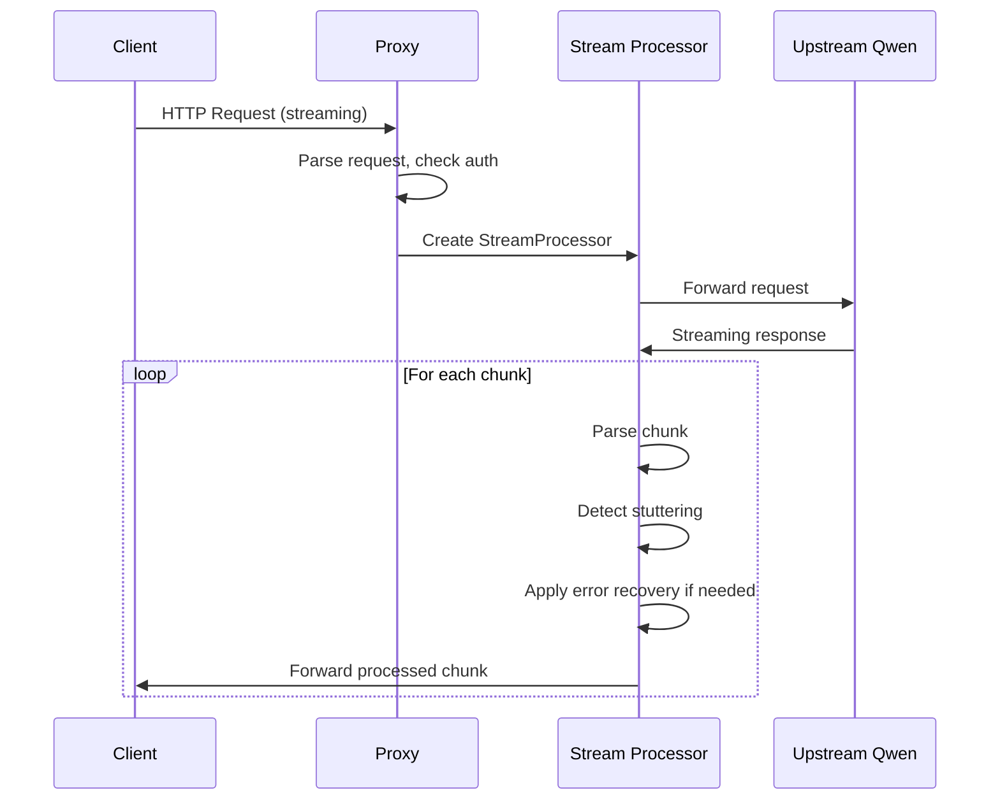
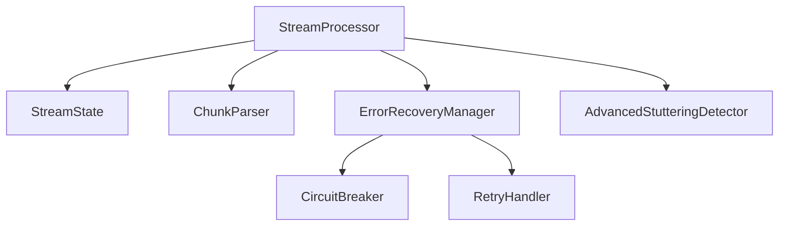
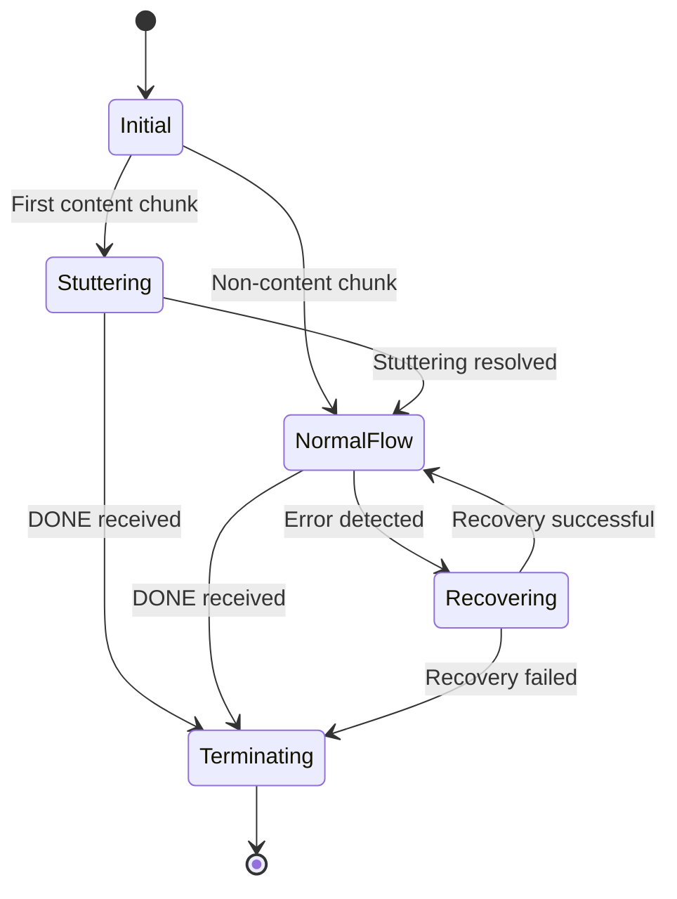
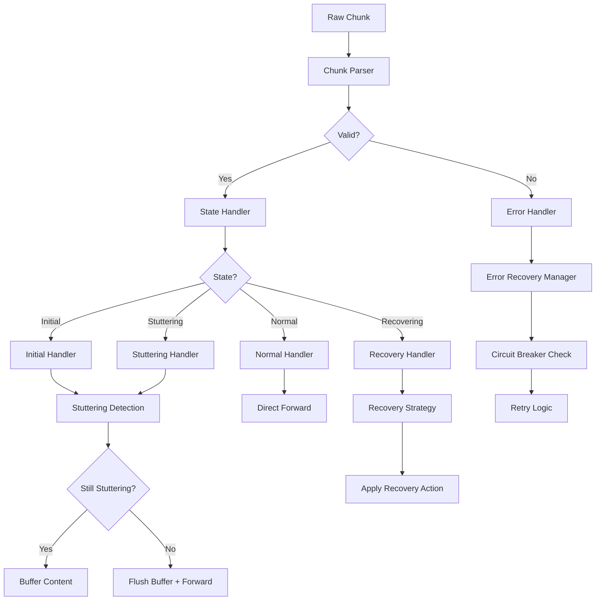
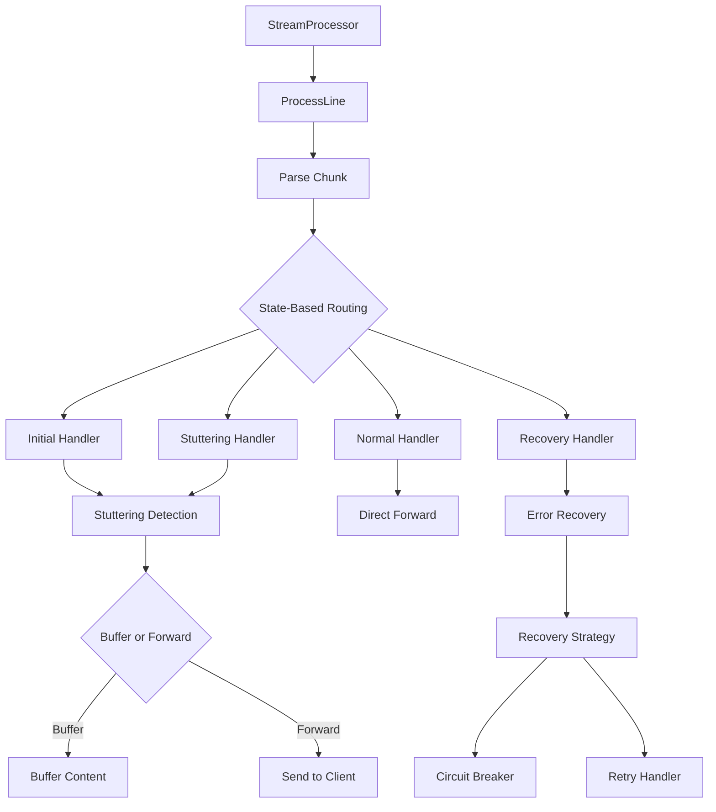
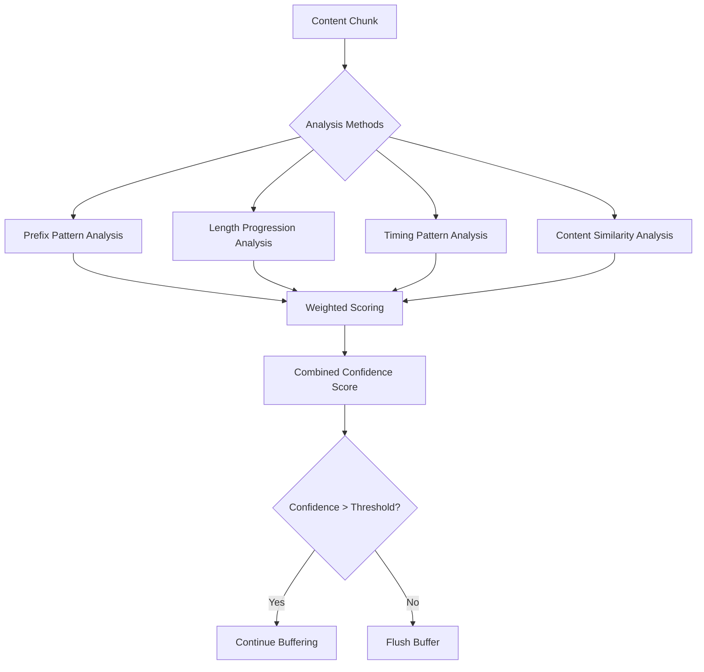
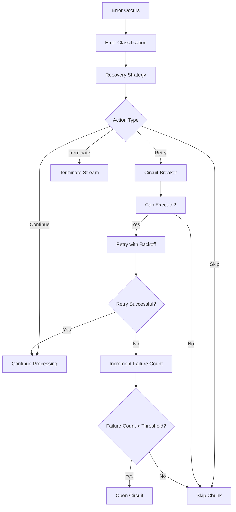
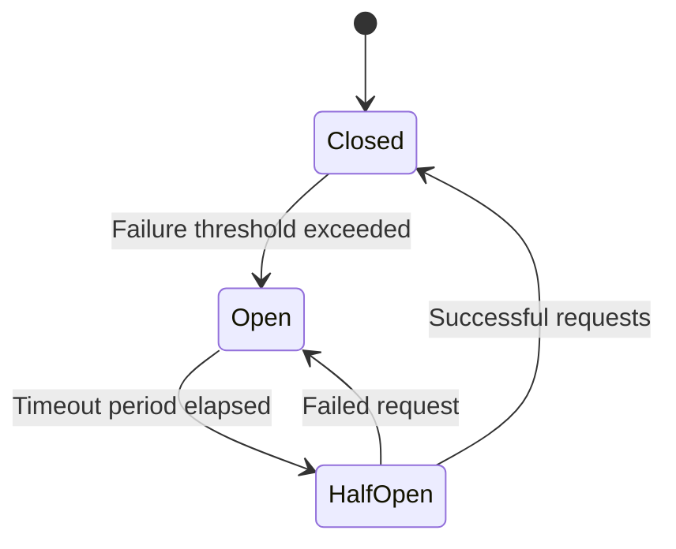

# Qwencoder-Proxy System Architecture

## 1. High-Level System Architecture

The qwencoder-proxy is a sophisticated proxy service that forwards requests to an upstream Qwen service while providing enhanced features for handling streaming responses. The system is built with a component-based architecture that separates concerns and provides resilience through circuit breaker and retry mechanisms.

### Core Components

1. **Proxy Handler** (`proxy/handler.go`): Main entry point that routes requests based on type
2. **Streaming Handler** (`proxy/streaming_handler.go`): Manages streaming request processing
3. **Stream Processor** (`proxy/streaming.go`): Coordinates stream processing with state management
4. **Chunk Parser** (`proxy/streaming.go`): Robust parsing with comprehensive error handling
5. **Error Recovery Manager** (`proxy/streaming.go`): Configurable recovery strategies with circuit breaker
6. **Stuttering Detector** (`proxy/advanced_stuttering.go`): Advanced stuttering detection algorithms
7. **Circuit Breaker** (`proxy/circuit_breaker.go`): Circuit breaker pattern for upstream resilience

## 2. Control Flow

### Non-Streaming Requests

Non-streaming requests follow a straightforward path:

1. Client sends request to proxy
2. Proxy handler determines it's a non-streaming request
3. Request is forwarded directly to upstream Qwen service
4. Response is copied back to client without additional processing

### Streaming Requests

Streaming requests use a sophisticated processing pipeline:

1. Client sends streaming request to proxy
2. Proxy handler identifies streaming request and delegates to streaming handler
3. Streaming handler creates StreamProcessor with all components
4. Response is read line-by-line from upstream
5. Each line is processed through the component pipeline
6. Processed content is forwarded to client with appropriate buffering

## 3. Detailed Processing Flow for Streaming Requests

### Component-Based Architecture

The refactored streaming architecture uses a component-based approach with clear separation of concerns:

### Stream State Machine

The processing follows a state machine with five distinct states:

1. **StateInitial**: Initial state when processing begins
2. **StateStuttering**: Buffering chunks while detecting stuttering patterns
3. **StateNormalFlow**: Normal streaming with direct forwarding
4. **StateRecovering**: Error recovery in progress
5. **StateTerminating**: Stream completion or error termination

### Chunk Processing Pipeline

Each chunk goes through a detailed processing pipeline:

1. **Parsing**: ChunkParser converts raw line into structured ParsedChunk
2. **State Handling**: StreamProcessor routes chunk based on current state
3. **Stuttering Detection**: Advanced algorithms analyze content patterns
4. **Error Handling**: ErrorRecoveryManager applies appropriate strategies
5. **Forwarding**: Processed content is sent to client

## 4. Component Interactions and Data Flow

### StreamProcessor and Components

The StreamProcessor orchestrates all components:

### Advanced Stuttering Detection

The sophisticated stuttering detection uses multiple analysis methods:

### Error Recovery with Circuit Breaker

Error handling is enhanced with circuit breaker and retry mechanisms:

## 5. Resilience Mechanisms

### Circuit Breaker Pattern

The system implements the circuit breaker pattern to prevent cascade failures:

1. **Closed State**: Normal operation, all requests allowed
2. **Open State**: Failure threshold exceeded, requests blocked
3. **Half-Open State**: Testing recovery with limited requests

### Retry with Exponential Backoff

Retry logic uses exponential backoff with jitter:

1. Configurable max retries
2. Exponential delay increase
3. Random jitter to prevent thundering herd
4. Smart error classification for retryable errors

## 6. Configuration and Monitoring

The system supports configuration through environment variables:

- `STREAMING_MAX_ERRORS`: Maximum errors before termination
- `STREAMING_BUFFER_SIZE`: Buffer size for processing
- `STREAMING_TIMEOUT_SECONDS`: Processing timeout

Monitoring capabilities include:
- Detailed logging at each processing stage
- State transition tracking
- Error statistics and circuit breaker status
- Performance metrics

This architecture provides a robust, scalable solution for handling streaming responses with sophisticated stuttering detection and error recovery mechanisms.