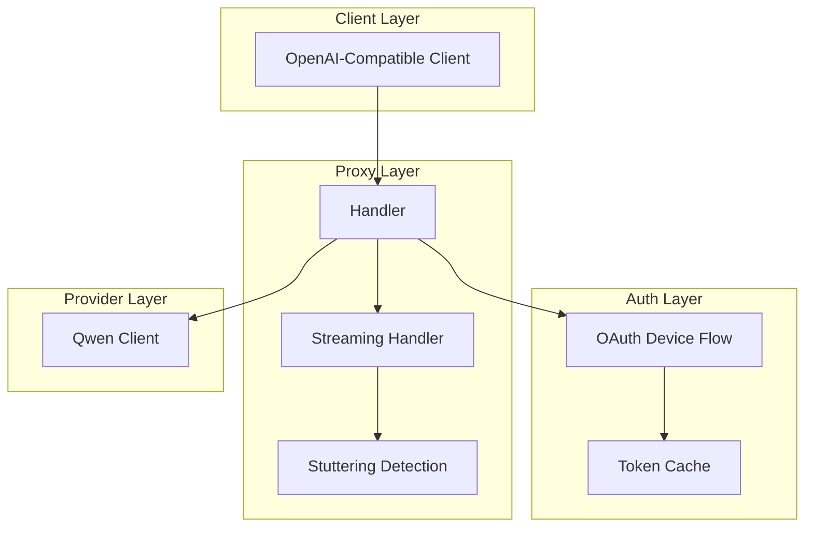
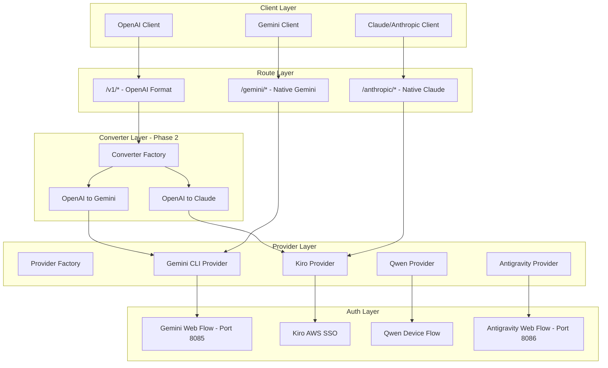
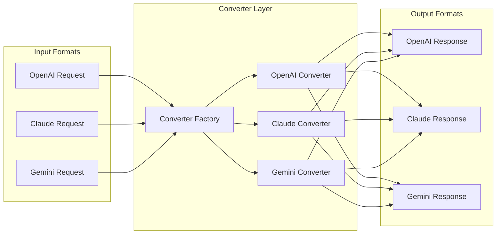
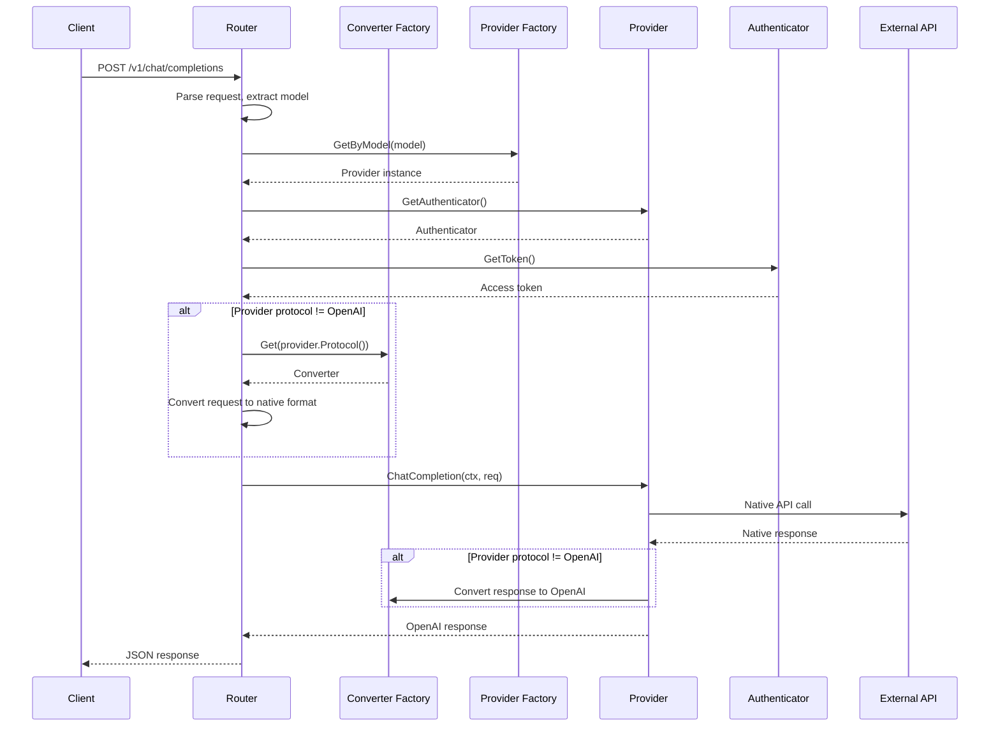

# Multi-Provider Architecture Plan

## Executive Summary

This document outlines the architectural plan for extending the qwencoder-proxy to support multiple LLM providers (Gemini CLI, KiroDev/Claude, and Google Antigravity). The implementation follows a **phased approach**:

**Phase 1**: Native format routes (`/gemini/*`, `/anthropic/*`) - Test auth and model access
**Phase 2**: OpenAI-compatible routes (`/v1/*`) - Add format conversion
**Phase 3**: Cleanup and optimization

The plan includes:

1. **Provider abstraction layer** with interface-based design
2. **Native API routes** for Gemini and Anthropic/Claude formats
3. **Protocol converters** for translating between OpenAI and native provider formats
4. **Authentication module restructuring** for multiple OAuth flows
5. **Codebase cleanup** removing stuttering detection

---

## Current State Analysis

### Existing Architecture



### Current Files Structure

| Directory | Purpose | Status |
|-----------|---------|--------|
| [`auth/`](auth/) | OAuth authentication for Qwen | Needs extension for multiple providers |
| [`proxy/`](proxy/) | HTTP proxy handlers | Needs refactoring for provider abstraction |
| [`qwenclient/`](qwenclient/) | Qwen-specific API client | Will be replaced by provider abstraction |
| [`config/`](config/) | Configuration management | Needs extension for provider configs |
| [`logging/`](logging/) | Logging utilities | Keep as-is |
| [`cmd/`](cmd/) | Main entry point | Minor updates needed |

### Files to Remove (Stuttering Detection)

- [`proxy/advanced_stuttering.go`](proxy/advanced_stuttering.go)
- [`proxy/advanced_stuttering_test.go`](proxy/advanced_stuttering_test.go)
- [`proxy/streaming.go`](proxy/streaming.go) - Contains `StutteringDetector`, `StreamState` (refactor needed)
- [`proxy/streaming_test.go`](proxy/streaming_test.go)

---

## Target Architecture

### High-Level Design - Route-Based Architecture



### Route Structure

| Route Pattern | Format | Provider | Phase |
|---------------|--------|----------|-------|
| `/gemini/models` | Gemini Native | Gemini CLI | Phase 1A |
| `/gemini/models/{model}:generateContent` | Gemini Native | Gemini CLI | Phase 1A |
| `/gemini/models/{model}:streamGenerateContent` | Gemini Native | Gemini CLI | Phase 1A |
| `/anthropic/models` | Claude Native | Kiro | Phase 1B |
| `/anthropic/messages` | Claude Native | Kiro | Phase 1B |
| `/v1/models` | OpenAI | All Providers | Phase 2 |
| `/v1/chat/completions` | OpenAI | Route by Model | Phase 2 |

### Provider Interface Design

```go
// provider/provider.go
type Provider interface {
    // Name returns the provider identifier
    Name() string
    
    // Protocol returns the native protocol (openai, gemini, claude)
    Protocol() string
    
    // SupportedModels returns list of supported model IDs
    SupportedModels() []string
    
    // GenerateContent handles non-streaming requests
    GenerateContent(ctx context.Context, req *ProviderRequest) (*ProviderResponse, error)
    
    // GenerateContentStream handles streaming requests
    GenerateContentStream(ctx context.Context, req *ProviderRequest) (<-chan *ProviderChunk, error)
    
    // ListModels returns available models
    ListModels(ctx context.Context) ([]Model, error)
    
    // GetAuthenticator returns the auth handler for this provider
    GetAuthenticator() Authenticator
    
    // IsHealthy checks if the provider is available
    IsHealthy(ctx context.Context) bool
}
```

### Converter Architecture



---

## New Directory Structure

```
qwencoder-proxy/
├── cmd/
│   └── qwencoder-proxy/
│       └── main.go                    # Updated entry point
├── config/
│   ├── config.go                      # Extended for multi-provider
│   ├── loader.go                      # Config loading
│   └── provider_config.go             # NEW: Provider-specific configs
├── auth/
│   ├── authenticator.go               # NEW: Auth interface
│   ├── device_flow.go                 # Renamed from oauth2_device.go
│   ├── web_flow.go                    # NEW: Web OAuth flow
│   ├── aws_sso.go                     # NEW: AWS SSO for Kiro
│   ├── token_store.go                 # NEW: Unified token storage
│   └── constants.go                   # Provider constants
├── provider/
│   ├── provider.go                    # NEW: Provider interface
│   ├── factory.go                     # NEW: Provider factory
│   ├── models.go                      # NEW: Model definitions
│   ├── qwen/
│   │   └── qwen.go                    # Qwen provider implementation
│   ├── gemini/
│   │   └── gemini.go                  # Gemini CLI provider
│   ├── kiro/
│   │   └── kiro.go                    # KiroDev/Claude provider
│   └── antigravity/
│       └── antigravity.go             # Google Antigravity provider
├── converter/
│   ├── converter.go                   # NEW: Converter interface
│   ├── factory.go                     # NEW: Converter factory
│   ├── openai.go                      # NEW: OpenAI format converter
│   ├── claude.go                      # NEW: Claude format converter
│   ├── gemini.go                      # NEW: Gemini format converter
│   └── types.go                       # NEW: Common types
├── proxy/
│   ├── handler.go                     # Refactored main handler
│   ├── router.go                      # NEW: Request routing
│   ├── streaming.go                   # Simplified streaming (no stuttering)
│   ├── headers.go                     # Header management
│   └── client.go                      # HTTP client
├── logging/
│   ├── logger.go                      # Keep as-is
│   └── debug.go                       # Keep as-is
└── plans/
    └── multi-provider-architecture-plan.md
```

---

## Detailed Component Design

### 1. Provider Interface and Factory

```go
// provider/provider.go
package provider

import (
    "context"
    "github.com/openai/openai-go"
)

// ProviderType identifies the provider
type ProviderType string

const (
    ProviderQwen        ProviderType = "qwen"
    ProviderGeminiCLI   ProviderType = "gemini-cli"
    ProviderKiro        ProviderType = "kiro"
    ProviderAntigravity ProviderType = "antigravity"
)

// ProtocolType identifies the native API protocol
type ProtocolType string

const (
    ProtocolOpenAI  ProtocolType = "openai"
    ProtocolGemini  ProtocolType = "gemini"
    ProtocolClaude  ProtocolType = "claude"
)

// Provider defines the interface for LLM providers
type Provider interface {
    Name() ProviderType
    Protocol() ProtocolType
    SupportedModels() []string
    
    // Chat completion methods
    ChatCompletion(ctx context.Context, req otCompletionNewParams) (*openai.ChatCompletion, error)
    ChatCompletionStream(ctx context.Context, req openai.ChatCompletionNewParams) (*openai.ChatCompletionStream, error)
    
    // Model listing
    ListModels(ctx context.Context) (*openai.ModelListResponse, error)
    
    // Health and auth
    GetAuthenticator() auth.Authenticator
    IsHealthy(ctx context.Context) bool
}

// provider/factory.go
package provider

type Factory struct {
    providers map[ProviderType]Provider
    config    *config.Config
}

func NewFactory(cfg *config.Config) *Factory {
    return &Factory{
        providers: make(map[ProviderType]Provider),
        config:    cfg,
    }
}

func (f *Factory) Register(p Provider) {
    f.providers[p.Name()] = p
}

func (f *Factory) Get(providerType ProviderType) (Provider, error) {
    p, ok := f.providers[providerType]
    if !ok {
        return nil, fmt.Errorf("provider not found: %s", providerType)
    }
    return p, nil
}

func (f *Factory) GetByModel(model string) (Provider, error) {
    for _, p := range f.providers {
        for _, m := range p.SupportedModels() {
            if m == model || strings.HasPrefix(model, m) {
                return p, nil
            }
        }
    }
    return nil, fmt.Errorf("no provider found for model: %s", model)
}
```

### 2. Converter Architecture

```go
// converter/converter.go
package converter

import (
    "github.com/openai/openai-go"
)

// Converter handles protocol translation
type Converter interface {
    // ToOpenAI converts native format to OpenAI format
    ToOpenAIRequest(native interface{}) (*openai.ChatCompletionNewParams, error)
    ToOpenAIResponse(native interface{}, model string) (*openai.ChatCompletion, error)
    ToOpenAIStreamChunk(native interface{}, model string) (*openai.ChatCompletionChunk, error)
    
    // FromOpenAI converts OpenAI format to native format
    FromOpenAIRequest(req *openai.ChatCompletionNewParams) (interface{}, error)
    FromOpenAIResponse(resp *openai.ChatCompletion) (interface{}, error)
    
    // Protocol returns the native protocol this convndles
    Protocol() ProtocolType
}

// converter/factory.go
package converter

type Factory struct {
    converters map[ProtocolType]Converter
}

func NewFactory() *Factory {
    f := &Factory{
        converters: make(map[ProtocolType]Converter),
    }
    // Register default converters
    f.Register(NewOpenAIConverter())
    f.Register(NewGeminiConverter())
    f.Register(NewClaudeConverter())
    return f
}

func (f *Factory) Get(protocol ProtocolType) (Converter, error) {
    c, ok := f.converters[protocol]
    if !ok {
        rett.Errorf("converter not found for protocol: %s", protocol)
    }
    return c, nil
}
```

### 3. Authentication Module

```go
// auth/authenticator.go
package auth

import "context"

// Authenticator defines the interface for provider authentication
type Authenticator interface {
    // Authenticate performs the authentication flow
    Authenticate(ctx context.Context) error
    
    // GetToken returns a valid access token, refreshing if necessary
    GetToken(ctx context.Context) (string, error)
    
    // IsAuthenticated checks if valid credentials exist
    IsAuthenticated() bool
    
    // GetCredentialsPath returns the path to stored credentials
    GetCredentialsPath() string
    
    // ClearCredentials removes stored credentials
    ClearCredentials() error
}

// auth/device_flow.go - For Qwen
type DeviceFlowAuth struct {
    clientID     string
    scope        string
    tokenURL     string
    deviceURL    string
    credsDir     string
    credsFile    string
    tokenStore   *TokenStore
}

// auth/web_flow.go - For Gemini CLI and Antigravity
type WebFlowAuth struct {
    clientID     string
    clientSecret string
    scope        string
    redirectPort int
    credsDir     string
    credsFile    string
    tokenStore   *TokenStore
}

// auth/aws_sso.go - For Kiro
type AWSSSOAuth struct {
    region       string
    refreshURL   string
    refreshIDCURL string
    credsPath    string
    tokenStore   *TokenStore
}
```

### 4. Simplified Streaming Handler

```go
// proxy/streaming.go
package proxy

import (
    "bufio"
    "context"
    "io"
    "net/http"
)

// StreamProcessor handles streaming responses without stuttering detection
type StreamProcessor struct {
    writer     http.ResponseWriter
    ctx        context.Context
    chunkCount int
}

func NewStreamProcessor(w http.ResponseWriter, ctx context.Context) *StreamProcessor {
    return &StreamProcessor{
        writer: w,
        ctx:    ctx,
    }
}

func (sp *StreamProcessor) ProcessLine(line string) error {
    select {
    case <-sp.ctx.Done():
        return sp.ctx.Err()
    default:
        _, err := sp.writer.Write([]byte(line))
        if err != nil {
            return err
        }
        if flusher, ok := sp.writer.(http.Flusher); ok {
            flusher.Flush()
        }
        sp.chunkCount++
        return nil
    }
}
```

---

## OpenAI SDK Integration

### Why OpenAI SDK?

1. **Type Safety**: Strongly typed request/response structures
2. **Streaming Support**: Built-in SSE handling
3. **Consistency**: Standard OpenAI format across all providers
4. **Maintenance**: Less custom code to maintain

### Integration Approach

```go
// Using github.com/openai/openai-go
import "github.com/openai/openai-go"

// All providers will output OpenAI-compatible types
type Provider interface {
    ChatCompletion(ctx context.Context, req openai.ChatCompletionNewParams) (*openai.ChatCompletion, error)
    ChatCompletionStream(ctx context.Context, req openai.ChatCompletionNewParams) (*openai.ChatCompletionStream, error)
}
```

### Dependencies to Add

```go
// go.mod additions
require (
    github.com/openai/openai-go v0.1.0-alpha.x
    golang.org/x/oauth2 v0.27.0  // existing
)
```

---

## Provider Implementation Details

### 1. Qwen Provider (Existing - Refactor)

| Aspect | Current | Target |
|--------|---------|--------|
| Auth | Device Flow | Keep as-is |
| Protocol | OpenAI-compatible | OpenAI SDK types |
| Endpoint | `https://chat.qwen.ai/api/v1` | Keep as-is |

### 2. Gemini CLI Provider (New)

| Aspect | Value |
|--------|-------|
| Auth | Web Flow (port 8085) |
| Protocol | Gemini native → Convert to OpenAI |
| Endpoint | `https://generativelanguage.googleapis.com/v1beta` |
| Client ID | `681255809395-oo8ft2oprdrnp9e3aqf6av3hmdib135j.apps.googleusercontent.com` |

### 3. Kiro Provider (New)

| Aspect | Value |
|--------|-------|
| Auth | AWS SSO (pre-existing credentials) |
| Protocol | Claude native → Convert to OpenAI |
| Endpoint | `https://codewhisperer.us-east-1.amazonaws.com` |
| Creds Path | `~/.aws/sso/cache/kiro-auth-token.json` |

### 4. Antigravity Provider (New)

| Aspect | Value |
|--------|-------|
| Auth | Web Flow (port 8086) |
| Protocol | Custom Antigravity → Convert to OpenAI |
| Endpoint | `https://daily-cloudcode-pa.sandbox.googleapis.com` |
| Client ID | `1071006060591-tmhssin2h21lcre235vtolojh4g403ep.apps.googleusercontent.com` |

---

## Request Flow



---

## Configuration Schema

```yaml
# config.yaml (example)
server:
  port: 8143
  debug: false

providers:
  qwen:
    enabled: true
    # Uses device flow auth
    
  gemini-cli:
    enabled: true
    oauth:
      client_id: "681255809395-oo8ft2oprdrnp9e3aqf6av3hmdib135j.apps.googleusercontent.com"
      client_secret: "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"
      callback_port: 8085
      
  kiro:
    enabled: true
    region: "us-east-1"
    credentials_path: "~/.aws/sso/cache/kiro-auth-token.json"
    
  antigravity:
    enabled: true
    oauth:
      client_id: "1071006060591-tmhssin2h21lcre235vtolojh4g403ep.apps.googleusercontent.com"
      client_secret: "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"
      callback_port: 8086
    base_url: "https://daily-cloudcode-pa.sandbox.googleapis.com"

default_provider: qwen

http_client:
  timeout_seconds: 300
  streaming_timeout_seconds: 900
```

---

## Implementation Strategy - Phased Approach

### Phase 1: Native Format Routes (Test Auth and Model Access)

The goal of Phase 1 is to implement native API routes to verify authentication and model access work correctly before adding format conversion complexity.

#### Phase 1A: Gemini Native Routes (`/gemini/*`)

**Routes to implement:**
- `GET /gemini/models` - List available Gemini models
- `POST /gemini/models/{model}:generateContent` - Non-streaming generation
- `POST /gemini/models/{model}:streamGenerateContent` - Streaming generation

**Components:**
1. Gemini Web Flow OAuth authentication (port 8085)
2. Gemini provider with native request/response handling
3. Route handler for `/gemini/*` paths

**Request/Response Format:** Native Gemini API format
```json
// Request
{
  "contents": [{"role": "user", "parts": [{"text": "Hello"}]}],
  "generationConfig": {"temperature": 0.7}
}

// Response
{
  "candidates": [{"content": {"parts": [{"text": "Hi there!"}], "role": "model"}}],
  "usageMetadata": {"promptTokenCount": 1, "candidatesTokenCount": 3}
}
```

#### Phase 1B: Anthropic/Claude Native Routes (`/anthropic/*`)

**Routes to implement:**
- `GET /anthropic/models` - List available Claude models (via Kiro)
- `POST /anthropic/messages` - Non-streaming messages
- `POST /anthropic/messages` (with stream: true) - Streaming messages

**Components:**
1. Kiro AWS SSO authentication (pre-existing credentials)
2. Kiro provider with Claude-compatible request/response handling
3. Route handler for `/anthropic/*` paths

**Request/Response Format:** Native Anthropic/Claude API format
```json
// Request
{
  "model": "claude-sonnet-4-5",
  "max_tokens": 1024,
  "messages": [{"role": "user", "content": "Hello"}]
}

// Response
{
  "id": "msg_xxx",
  "type": "message",
  "role": "assistant",
  "content": [{"type": "text", "text": "Hi there!"}],
  "model": "claude-sonnet-4-5",
  "usage": {"input_tokens": 1, "output_tokens": 3}
}
```

#### Phase 1C: Testing and Validation

1. Test Gemini OAuth flow and token refresh
2. Test Kiro AWS SSO credential loading and refresh
3. Verify model listing for both providers
4. Test non-streaming requests
5. Test streaming requests
6. Verify error handling and edge cases

### Phase 2: OpenAI-Compatib (`/v1/*`)

After Phase 1 validates auth and model access, add OpenAI format conversion.

#### Phase 2A: Converter Implementation

1. Implement OpenAI ↔ Gemini converter
2. Implement OpenAI ↔ Claude converter
3. Add converter factory

#### Phase 2B: Unified `/v1/*` Routes

**Routes:**
- `GET /v1/models` - List all models from all providers
- `POST /v1/chat/completions` - Route to appropriate provider based on model

**Model Routing Logic:**
- `gemini-*` models → Gemini CLI provider
- `claude-*` models → Kiro provider
- `qwen*` models → Qwen provider (existing)

### Phase 3 and Optimization

1. Remove stuttering detection code completely
2. Refactor existing Qwen provider to use new interface
3. Add Antigravity provider
4. Performance optimization
5. Documentation updates

---

## Files to Create

| File | Purpose |
|------|---------|
| `provider/provider.go` | Provider interface definition |
| `provider/factory.go` | Provider factory |
| `provider/models.go` | Model definitions and mappings |
| `provider/qwen/qwen.go` | Qwen provider implementation |
| `provider/gemini/gemini.go` | Gemini CLI provider |
| `provider/kiro/kiro.go` | Kiro/Claude provider |
| `provider/antigravity/antigravity.go` | Antigravity provider |
| `converter/converter.go` | Converter interface |
| `converter/factory.go` | Converter factory |
| `converter/openai.go` | OpenAI format converter |
| `converter/claude.go` | Claude format converter |
| `converter/gemini.go` | Gemini format converter |
| `converter/types.go` | Common types |
| `auth/authenticator.go` | Auth interface |
| `auth/web_flow.go` | Web OAuth flow |
| `auth/aws_sso.go` | AWS SSO auth |
| `auth/token_store.go` | Unified token storage |
| `config/provider_config.go` | Provider configurations |
| `proxy/router.go` | Request routing |

## Files to Modify

| File | Changes |
|------|---------|
| `go.mod` | Add OpenAI SDK dependency |
| `cmd/qwencoder-proxy/main.go` | Initialize provider factory |
| `proxy/handler.go` | Use provider factory, remove stuttering |
| `proxy/streaming.go` | Simplify, remove stuttering detection |
| `config/config.go` | Add provider configurations |
| `auth/oauth.go` | Refactor to implement Authenticator |
| `auth/oauth2_device.go` | Rename to device_flow.go |

## Files to Delete

| File | Reason |
|------|--------|
| `proxy/advanced_stuttering.go` | Stuttering detection removed |
| `proxy/advanced_stuttering_test.go` | Stuttering detection removed |
| `qwenclient/api.go` | Replaced by provider abstraction |

---

## Risk Assessment

| Risk | Mitigation |
|------|------------|
| Breaking existing Qwen functionality | Comprehensive testing, gradual migration |
| OAuth flow differences between providers | Abstract auth interface, provider-specific implementations |
| Protocol conversion errors | Extensive unit tests for converters |
| Performance impact from conversions | Benchmark testing, optimize hot paths |

---

## Success Criteria

1. All four providers (Qwen, Gemini CLI, Kiro, Antigravity) accessible via OpenAI-compatible API
2. Stuttering detection completely removed
3. Clean, maintainable codebase with clear separation of concerns
4. All existing Qwen functionality preserved
5. Comprehensive test coverage for new components
