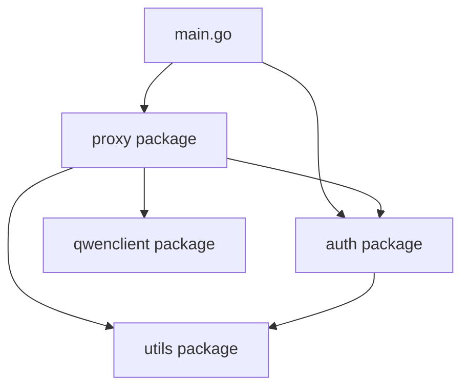

# QwenProxy Project Refactoring Plan

## Current Structure Analysis
The current project has all code in the main package with the following files:
- `constants.go` - Contains constants and HTTP client initialization
- `main.go` - Contains main function, HTTP handlers, and core proxy logic
- `oauth.go` - Contains OAuth authentication logic
- `streaming.go` - Contains streaming proxy handler and related functions
- `models.json` - Contains model information (data file)

## Proposed Package Structure

### 1. `/auth` Package
**Purpose**: Handle all authentication and OAuth-related functionality
**Contents**:
- OAuth credentials structures
- OAuth constants
- Authentication functions (`AuthenticateWithOAuth`, `LoadQwenCredentials`, `SaveOAuthCreds`, etc.)
- Token management functions (`refreshAccessToken`, `isTokenValid`, etc.)
- PKCE-related functions

### 2. `/proxy` Package
**Purpose**: Handle HTTP proxy functionality
**Contents**:
- Main proxy handler (`ProxyHandler`)
- Request preparation functions (`PrepareRequest`)
- Response handling functions (`HandleResponse`)
- Non-streaming proxy handler (`NonStreamProxyHandler`)
- Streaming proxy handler (`StreamProxyHandler`)
- Streaming data structures (`ChatCompletionChunk`, `Choice`, `Delta`, `Usage`, etc.)
- Streaming helper functions (`handleDoneMessage`, `handleUsageData`, `handleStuttering`, etc.)
- HTTP route handlers (`ModelsHandler`)
- Shared HTTP client

### 3. `/qwenclient` Package
**Purpose**: Handle communication with Qwen API
**Contents**:
- Qwen API constants
- Token and endpoint management (`GetValidTokenAndEndpoint`)
- Request/response formatting functions

### 4. `/utils` Package
**Purpose**: Common utility functions used across packages
**Contents**:
- Number formatting functions (`FormatIntWithCommas`)
- Common helper functions

### 5. `/models` Package (optional)
**Purpose**: Handle model-related data and operations
**Contents**:
- Model data structures
- Model information parsing

## Dependency Flow


## File Reorganization Plan

### Step 1: Create package directories
```
qwencoder-proxy/
├── auth/
├── proxy/
├── qwenclient/
├── utils/
├── models/
├── go.mod
├── models.json
└── cmd/
    └── qwencoder-proxy/
        └── main.go
```

### Step 2: Move and refactor files

#### `auth` package:
- Move OAuth-related code from `oauth.go`
- Update package declaration to `package auth`
- Update import paths

#### `proxy` package:
- Move proxy-related code from `main.go` and `streaming.go`
- Update package declaration to `package proxy`
- Update import paths

#### `qwenclient` package:
- Move Qwen client code from `main.go` and `oauth.go`
- Update package declaration to `package qwenclient`
- Update import paths

#### `utils` package:
- Move utility functions from `main.go`
- Update package declaration to `package utils`
- Update import paths

#### `main.go`:
- Move to `cmd/qwencoder-proxy/main.go`
- Update to use new package structure
- Keep only the main function and HTTP server setup

## Detailed Implementation Steps

1. Create the new directory structure
2. Move code to appropriate packages
3. Update package declarations
4. Update import paths
5. Export necessary functions/variables
6. Update main.go to use new package structure
7. Test all functionality
8. Update documentation if needed

## Functions to Export
Certain functions will need to be exported (capitalized) so they can be accessed from other packages:

- From `auth`: `AuthenticateWithOAuth`, `LoadQwenCredentials`, `SaveOAuthCreds`, `RefreshAccessToken`, `IsTokenValid`, `GetQwenCredentialsPath`
- From `proxy`: `ProxyHandler`, `ModelsHandler`, `PrepareRequest`, `HandleResponse`, `NonStreamProxyHandler`, `StreamProxyHandler`
- From `qwenclient`: `GetValidTokenAndEndpoint`
- From `utils`: `FormatIntWithCommas`

This refactoring will improve code organization, maintainability, and make it easier to test individual components.

---

## Refactoring Plan Completion Status

All steps outlined in this refactoring plan have been successfully completed:

- **Directory structure creation**: The new package directories (`auth`, `proxy`, `streaming`, `qwenclient`, `utils`) have been created as specified.
- **Code migration**: Code has been successfully migrated to the respective `auth`, `proxy`, `streaming`, `qwenclient`, and `utils` packages, ensuring proper encapsulation and organization.
- **`main.go` relocation and update**: The `main.go` file has been relocated to [`cmd/qwencoder-proxy/main.go`](cmd/qwencoder-proxy/main.go:0) and updated to integrate with the new package structure, handling the main function and HTTP server setup.
- **All functionalities tested and verified**: Comprehensive testing has been performed, and all functionalities of the QwenProxy project have been verified to be working correctly after the refactoring.